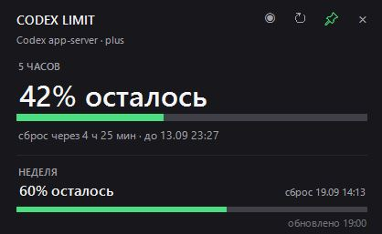
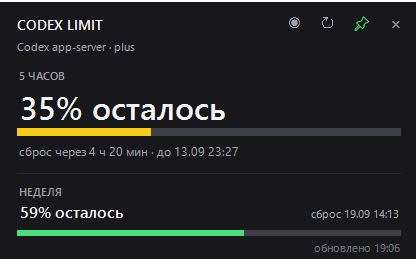
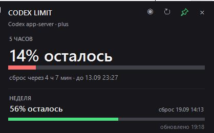
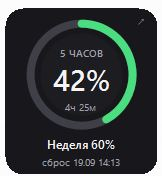
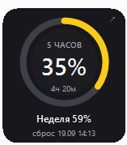
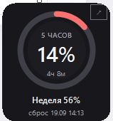
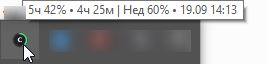
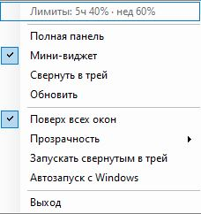

# Codex Limit Bar for Windows

Небольшой виджет для Windows, который показывает текущие лимиты использования Codex: 5-часовой и недельный лимит, оставшийся процент и время до сброса.

Приложение работает локально через Codex `app-server` и не отправляет дополнительные промпты модели.

[Скачать последнюю версию](https://github.com/zorkyglaiz/codex-limit-bar-windows/releases/latest)

---

## Интерфейс

### Полная панель

Полный режим показывает 5-часовой и недельный лимиты, время до сброса и время последнего обновления.

| | | |
|---|---|---|
|  |  |  |

### Мини-виджет

Компактный режим занимает минимум места и подходит для постоянного отображения поверх других окон.

| | | |
|---|---|---|
|  |  |  |

### Системный трей

При наведении на значок отображается краткая информация о лимитах.

| Подсказка при наведении | Меню приложения |
|---|---|
|  |  |

---

## Возможности

- отображение 5-часового лимита Codex
- отображение недельного лимита
- оставшийся процент использования
- время до сброса 5-часового лимита
- дата и время сброса недельного лимита
- автоматическое обновление данных
- системный трей Windows
- полная информационная панель
- компактный мини-виджет
- режим поверх всех окон
- прозрачность окна от 10% до 100%
- сохранение настроек
- автозапуск вместе с Windows
- запуск свернутым в трей
- ручное обновление данных
- цветовая индикация оставшегося лимита

---

## Режимы отображения

Codex Limit Bar поддерживает три режима.

### Полная панель

Основной режим с полной информацией:

- 5-часовой лимит
- недельный лимит
- время до сброса
- дата следующего недельного сброса
- время последнего обновления

### Мини-виджет

Небольшая плавающая панель.

Крупно отображает 5-часовой лимит, а ниже показывает недельный остаток и дату сброса.

Мини-виджет можно:

- перемещать по экрану
- закреплять поверх других окон
- делать полупрозрачным

### Системный трей

Приложение может работать только в системном трее.

Левый клик по значку открывает текущую панель.

Через меню трея доступны:

- полная панель
- мини-виджет
- свернуть в трей
- обновить данные
- поверх всех окон
- прозрачность
- запуск свернутым в трей
- автозапуск с Windows
- выход

---

## Установка

### Portable-версия

1. Перейдите в раздел [Releases](https://github.com/zorkyglaiz/codex-limit-bar-windows/releases).
2. Скачайте последнюю версию `CodexLimitBar-Windows-*.zip`.
3. Распакуйте архив.
4. Запустите:

```text
Start-CodexLimitBar.cmd
```

Устанавливать Python или дополнительные библиотеки не требуется.

### Установка для текущего пользователя

Запустите:

```text
Install.cmd
```

Программа будет установлена в профиль текущего пользователя Windows.

Для удаления используйте:

```text
Uninstall.cmd
```

---

## Автозапуск

Автозапуск можно включить прямо из меню приложения.

Также в комплект входят:

```text
Install-Autostart.cmd
Remove-Autostart.cmd
```

---

## Требования

- Windows 10 или Windows 11
- установленный Codex
- пользователь должен быть авторизован в Codex
- Windows PowerShell 5.1 или новее

На данный момент приложение протестировано с Codex для Windows, установленным из Microsoft Store.

---

## Как приложение получает лимиты

Codex Limit Bar использует локальный Codex `app-server`.

Для получения информации о лимитах используется метод:

```text
account/rateLimits/read
```

Приложение только читает текущую статистику использования.

Codex Limit Bar:

- не отправляет промпты
- не создаёт новые Codex-сессии
- не выполняет `turn/start`
- не запускает модель
- не расходует лимит Codex для получения статистики

---

## Обновление данных

Данные периодически обновляются автоматически.

Также обновление можно выполнить вручную через меню системного трея.

В интерфейсе отображается время последнего успешного обновления.

---

## Диагностика

Если приложение запускается, но лимиты не отображаются, используйте:

```text
Diagnose.cmd
```

Диагностика проверяет:

- расположение Codex
- наличие локального backend `codex.exe`
- запуск Codex `app-server`
- инициализацию соединения
- работу `account/rateLimits/read`

Для запуска приложения с отображением ошибок также доступен:

```text
Start-Debug.cmd
```

---

## Файлы проекта

Основные файлы:

```text
CodexLimitBar.ps1
CodexLimitProbe.ps1
CodexLimitBar.ico

Start-CodexLimitBar.cmd
Start-Debug.cmd

Diagnose.cmd
Diagnose.ps1

Install.cmd
Uninstall.cmd

Install-Autostart.cmd
Remove-Autostart.cmd
```

---

## Текущий статус

Проект находится в активной разработке.

Текущая публичная версия:

```text
v1.2.0
```

Если приложение работает с другой конфигурацией Codex или другой версией Windows, сообщения об успешной работе и найденных проблемах приветствуются.

---

## Лицензия

Проект распространяется по лицензии MIT.

См. файл [LICENSE](LICENSE).

---

## Disclaimer

Codex Limit Bar является независимым неофициальным проектом.

Проект не является продуктом OpenAI и не связан с OpenAI официально.
